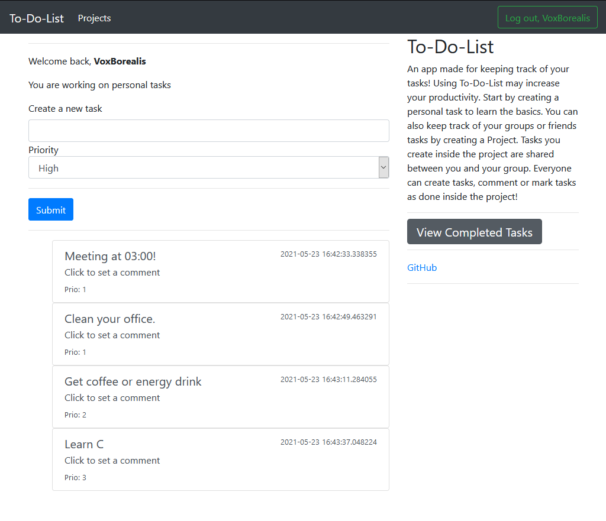

# To-Do-List-Web-Application

Created with: Python, Flask, SQL, HTML

[Link to Heroku](https://to-do-list-web-app-py.herokuapp.com/)

An app made for keeping track of your tasks!

Features:

* Personal tasks
    - The user can create a new account and log in/out.
    - The user can create a new task for themselves.
    - The user can set a priority level for their tasks.
    - The tasks will be ordered based on their priority.
    - The user may mark a task as 'done', therefore moving it to a 'Completed Tasks' list
    - The user can comment on their tasks (Description)

* Projects
    - Users may create a group task list called a project
    - Users can invite people to the project
    - Users can create tasks inside the project that everyone involved can interact with
    - Users may comment on each others tasks and mark them as 'Done'

